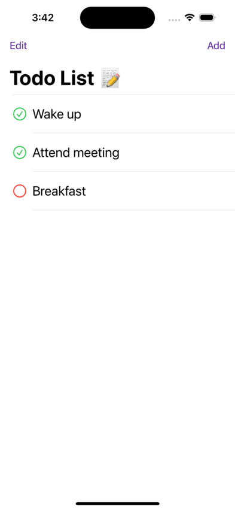

# Do It - A Swift SwiftUI To-Do List App

## Overview

Do It is a sleek and intuitive to-do list application built using SwiftUI, following the MVVM (Model-View-ViewModel) architecture. It leverages UserDefaults for data persistence and adheres to Apple's Human Interface Guidelines, ensuring a beautiful and user-friendly UI. The app incorporates animations to enhance the user experience and provides complete CRUD (Create, Read, Update, Delete) functionality for managing tasks efficiently. Additionally, it features a placeholder for images to showcase the app's aesthetics.

## Features

- **Intuitive User Interface**: The app boasts a user-friendly and visually appealing interface, designed in accordance with Apple's Human Interface Guidelines.

- **Data Persistence**: UserDefaults is utilized to securely store and manage task information, ensuring data consistency across app sessions.

- **Smooth Animations**: Enjoy smooth and subtle animations throughout the app, enhancing the overall user experience.

- **CRUD Functionality**: Do It supports full CRUD functionality, enabling users to easily create, read, update, and delete tasks with just a few taps.

- **Light and Dark Mode Support**: Do It offers a seamless experience with support for both light and dark modes, adapting to your preferred theme.

## Installation

1. Clone this repository to your local machine.

2. Open the project in Xcode.

3. Build and run the app on your iOS device or simulator.

## Usage

1. Launch the app.

2. Add a Task: Tap the "Add" button to create a new task, providing a title, description, and any other relevant details.

3. Update a Task: Select a task from the list, then tap the list item button to modify its content or status.

4. Delete a Task: Swipe left on a task in the list and tap "Delete" to remove it from your to-do list.

5. Enjoy the Animations: Experience delightful animations throughout the app, adding a touch of elegance to your task management.

## Screenshots

## License

This project is licensed under the MIT License - see the [LICENSE](LICENSE) file for details.

## Contact

If you have any questions or suggestions, please don't hesitate to reach out:

- Email: [saeedsaleem.04@gmail.com](mailto:saeedsaleem.04@gmail.com)
- Twitter: [@itssaeed592](https://twitter.com/itssaeed592)
- GitHub: [muhammadsaeed05](https://github.com/muhammadsaeed05)

Thank you for using Do It - your trusted task management companion.
